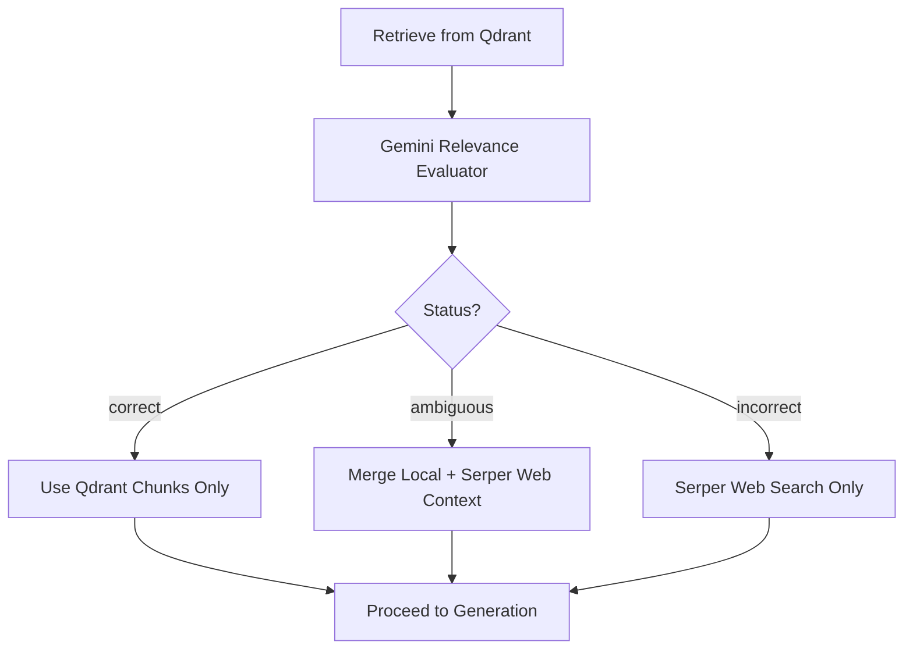

# CRAG Decision Flow

This workflow illustrates the Corrective Retrieval-Augmented Generation (CRAG) logic used to determine if retrieved context is sufficient or needs web augmentation.

## Logic States

- **Correct**: The local vector database contained a definitive answer. No external API calls are made to Serper.
- **Ambiguous**: The local docs are related but incomplete. The pipeline merges local snippets with real-time web results to maximize grounding.
- **Incorrect**: The local docs are irrelevant to the query (e.g., asking about current events). The system discards the local context to prevent hallucinations.
