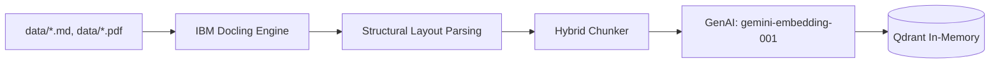

# Ingestion Workflow

This workflow visualizes how local documents are processed into the vector database.

## Strategy

- **Formats**: Supports `.md` (Markdown) and `.pdf`.
- **Parsing**: `Docling` is used for high-fidelity extraction of headings, lists, and tables.
- **Chunking**: `HybridChunker` ensures that semantic boundaries (like headings) are preserved across chunks.
- **Storage**: Chunks are stored in a volatile in-memory `Qdrant` collection, which is re-initialized on every script execution to ensure fresh data.
