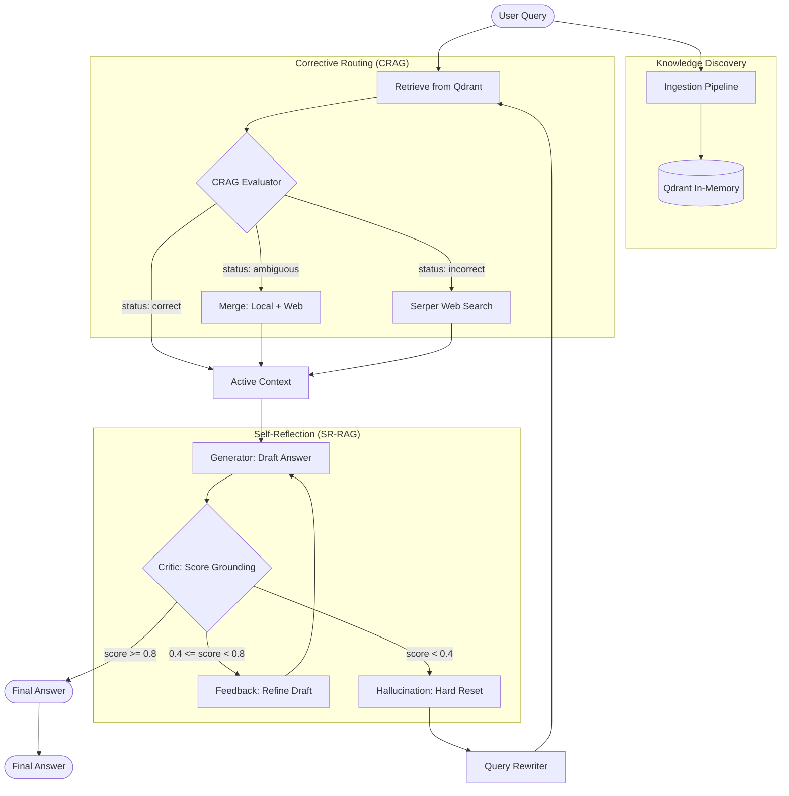

# Overall Project Architecture

This document visualizes the complete end-to-end flow of the Corrective and Self-Reflective RAG (CRAG/SR-RAG) pipeline.

## Key Components

1.  **Ingestion Engine**: Uses `docling` to parse local PDF/MD files and `Qdrant` for storage.
2.  **CRAG Evaluator**: Classifies context relevance into three states (Correct, Ambiguous, Incorrect) to determine if web search is needed.
3.  **SR-RAG Engine**: An iterative loop that generates drafts and critiques them for grounding.
4.  **Adaptive Retrieval**: If grounding fails severely, the **Query Rewriter** generates a new search query to re-trigger the CRAG/Retrieval process.
