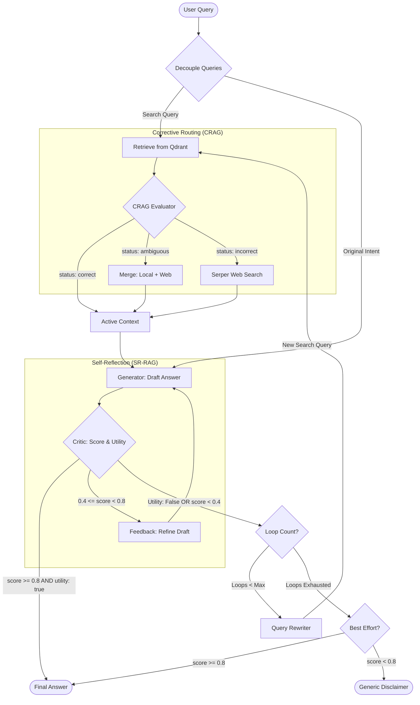

# Overall Project Architecture

This document visualizes the complete end-to-end flow of the Corrective and Self-Reflective RAG (CRAG/SR-RAG) pipeline.

## Key Components

1.  **Query Decoupling**: The orchestrator maintains the original user intent for generation while refined/surgical search queries are used for adaptive retrieval loops.
2.  **CRAG Evaluator**: Classifies context relevance into three states (Correct, Ambiguous, Incorrect) to determine if web search is needed.
3.  **Utility-Aware Critique**: The system evaluates not just if an answer is truthful (Grounding), but also if it actually addresses the user's intent (Utility).
4.  **Adaptive Retrieval**: If utility or grounding is low, the **Query Rewriter** optimizes the search query to re-trigger the CRAG/Retrieval process.
5.  **Best-Effort Delivery**: If search loops are exhausted, the system prioritizes grounded truths over generic errors, delivering partial answers if they are factually correct.
