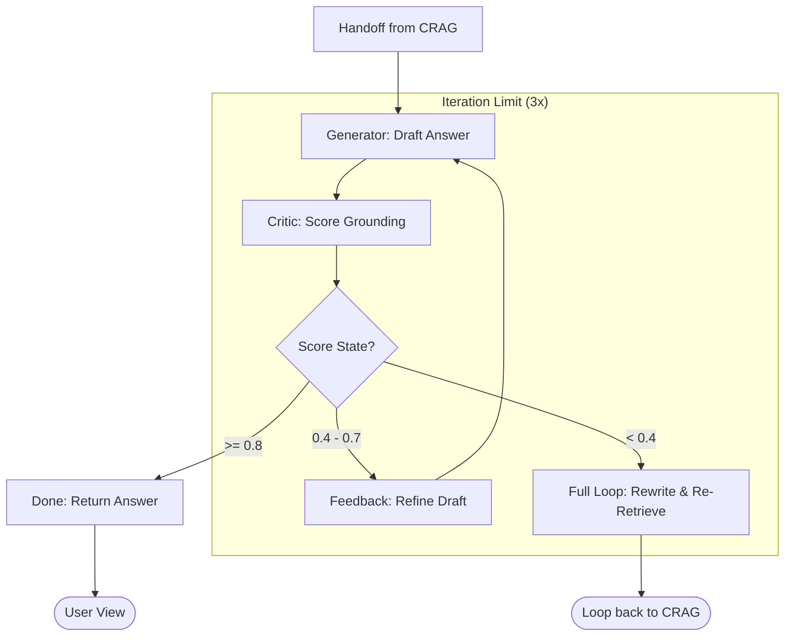

# SR-RAG Refinement Loop

This workflow details the Self-Reflective (SR-RAG) iteration loop, which handles grounded generation and hallucination prevention.

## Refinement Scenarios

- **Success (>= 0.8)**: The drafted answer is perfectly grounded in the context.
- **Partial Grounding (0.4 - 0.7)**: The answer is mostly correct but contains unverified claims. The Critic identifies the gaps, and the Generator refines the specific sections.
- **Hallucination (< 0.4)**: The draft contains severe inaccuracies. The system wipes the draft (Hard Reset) and retries with a "Strict Fact-Check" prompt.
