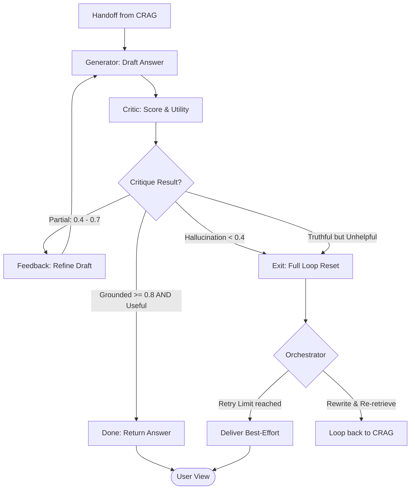

# SR-RAG Refinement Loop

This workflow details the Self-Reflective (SR-RAG) iteration loop, which handles grounded generation and hallucination prevention.

## Refinement Scenarios

- **Success (>= 0.8 & Useful)**: The drafted answer is perfectly grounded and provides the requested information.
- **Partial Grounding (0.4 - 0.7)**: The answer is mostly correct but contains unverified claims. The system iterates to fix the gaps.
- **Low Utility (Truthful Ignorance)**: The answer is grounded (e.g., "I don't know") but fails to provide data. This triggers a **Full Loop Reset** to hunt for better data on the web.
- **Hallucination (< 0.4)**: Inaccurate draft. Triggers a full re-search reset.
- **Best-Effort Delivery**: If search loops are exhausted, the system delivers the best grounded answer found, even if it includes gaps, instead of a generic error.
